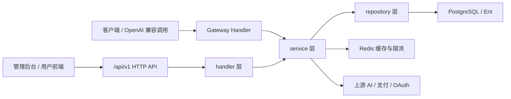

# 项目初始化认知上下文

## 用户问题

这个 fork 后续要加功能，但需要先了解项目本身情况，并初始化一个可交接的项目上下文。

## 结论摘要

- 当前工作分支是 `product/zhanzi`，用于承载本 fork 的长期定制；`main` 只跟随上游。
- 当前仓库是 Sub2API：AI API 网关平台，负责 API Key 分发、上游账号调度、鉴权、计费、负载均衡、请求转发、支付和管理后台。
- 后端是 Go + Gin + Ent + Redis + PostgreSQL；前端是 Vue 3 + Vite + Pinia + Vue Router + pnpm。
- `DEV_GUIDE.md` 有参考价值，但部分版本信息落后于当前 CI；后续以源码、`go.mod`、`package.json`、`.github/workflows/*` 和本计划为准。
- 当前仓库 `.gitignore` 忽略 `docs/*`、`AGENTS.md` 等协作资料；本 fork 的计划和规则文件需要在 `product/zhanzi` 上用 `git add -f` 纳入版本控制。

## 关键证据

- Fork 工作流真源：`AGENTS.md`
  - `origin = https://github.com/zhanzi/sub2api.git`
  - `upstream = https://github.com/Wei-Shaw/sub2api.git`
  - 长期产品分支：`product/zhanzi`
- 项目说明：`README_CN.md`
  - 项目定位：AI API 网关平台，处理订阅配额分发、API Key、计费、调度、支付和管理后台。
- 后端版本和依赖：`backend/go.mod`
  - module：`github.com/Wei-Shaw/sub2api`
  - Go：`1.26.3`
  - 关键依赖：Gin、Ent、Redis、Stripe、支付宝、微信支付、testcontainers。
- 前端版本和依赖：`frontend/package.json`
  - Vue 3、Vite 5、Pinia、Vue Router、Vue I18n、Vitest、pnpm。
- CI 真源：`.github/workflows/backend-ci.yml`
  - 后端单元测试：`make test-unit`
  - 后端集成测试：`make test-integration`
  - 前端检查：`make test-frontend`
  - golangci-lint：`v2.9`
- 后端入口：`backend/cmd/server/main.go`
  - 支持首次 setup、CLI setup、正常 server 三种启动路径。
- 路由入口：`backend/internal/server/router.go`
  - 注册 common、auth、user、admin、gateway、payment、page routes。
- 数据库迁移规则：`backend/migrations/README.md`
  - 迁移有 SHA256 checksum；已应用迁移不得修改；新增迁移必须 forward-only。
- 前端入口：`frontend/src/main.ts`、`frontend/src/router/index.ts`
  - Pinia、i18n、路由初始化后挂载；路由按 setup/public/user/admin 等页面组织。

## 当前架构速览

## 可信文档与注意事项

- 优先读：`AGENTS.md`、`README_CN.md`、`backend/go.mod`、`frontend/package.json`、`.github/workflows/*`、`backend/migrations/README.md`。
- 谨慎读：`DEV_GUIDE.md`。其中本地环境经验有价值，但 fork 远端和 Go/lint 版本已与当前仓库事实不完全一致。
- 修改数据库时只能追加迁移，不能编辑历史迁移。
- 修改 Ent schema 后必须执行生成并提交生成结果。
- 修改前端依赖必须使用 pnpm，并提交 `pnpm-lock.yaml`。
- 涉及计费、支付、额度、鉴权、租户隔离、上游账号调度、并发/限流、迁移时，必须先写专项计划和验收标准。
